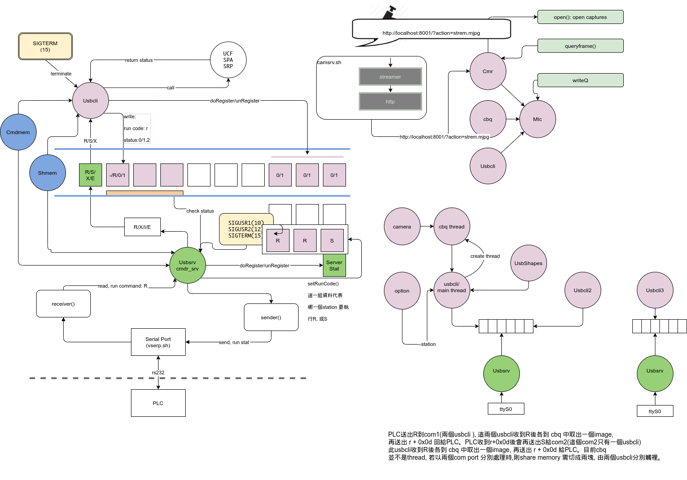

## USB_COMMANDER
### 取得"被測物"的3個影像, 並檢查其影像品質

USB commander 透過串列埠取得命令, 並由queue中取得影像, 並分別檢查其品質.

請參考下圖

<a href="https://drive.google.com/drive/folders/0Bxy4sFMiQRpQSEhtZjhrYzRmcUE">資料網址</a>

### source: bitbucket/ shmcmdr, not public
