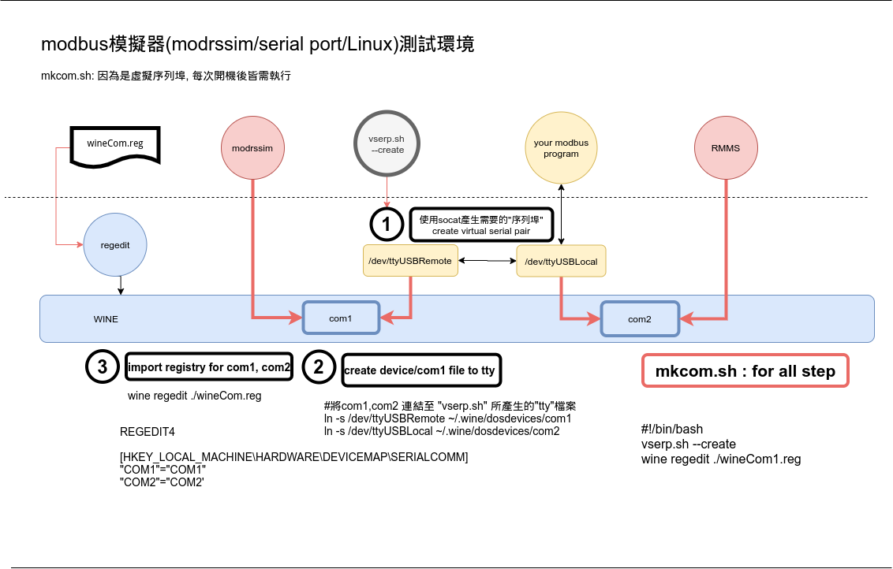
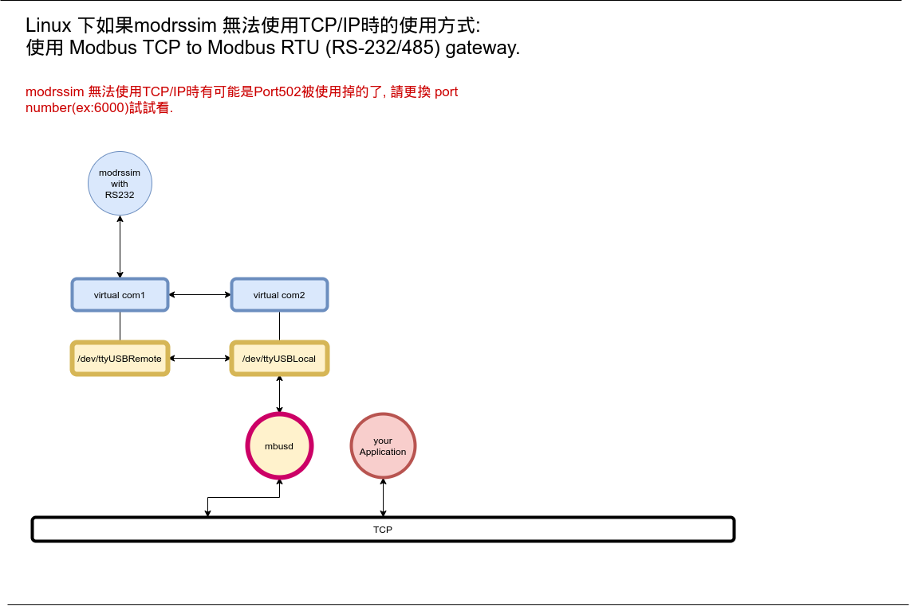

## 關於此文件

由於手邊工作會用的modbus協定, 此處特別會偏重於Modbus RTU設備, 而各廠商實體設備經常無法即時取得, 但有文件, 再加上開發環通常只在單機電腦, 因此常配合 modrssim/modrssim2, 以及 com0com 搭配在 windows環境上使用, 若是Linux環境通常要使用modbus模擬器, 常透過 modbus/TCP來使用。但如果設備只提供modbus RTU協定測試上還是較不方便, 因此花了一些時間調查與測試， 便將測試結果寫下來.

## modrssim 在 Linux/WINE 環境下的執行

<a href="https://sourceforge.net/projects/modrssim2/">Modrssim</a> 必須在Linux下需執行於 WINE下， 但 若要執行RTU模式則需要 WINE的COM PORT, 可使用<a href="https://github.com/esmi/wineser"> wineser/mkcom.sh</a>來產生兩個虛擬的序列埠 COM1, COM2, 實際上連結到 <a href="https://github.com/esmi/wineser/blob/master/vserp.sh">vserp.sh</a> 建立的 linux 虛擬序列埠對 /dev/ttyUSBLocal, 及/dev/ttyUSBRemote(這兩個tty是透過socat/vserp.sh 產生的端點), 請參考以下文件

PS:
```
vserp.sh 建立 linux 的 虛擬序列埠對:
/dev/ttyUSBLocal for com2: linux 端使用
/dev/ttyUSBRemote for com1: wine port 使用 (for modrssim2)

WINE 版本：2.4
```


WINE COM PORT <a href="https://www.onetransistor.eu/2015/12/wine-serial-port-linux.html">設定原理請參考"Set up the serial port in Wine"</a>

## modrssim 配合 <a href="https://github.com/3cky/mbusd">mbusd</a>

<a href="https://github.com/3cky/mbusd">mbusd</a> 是 Modbus TCP to Modbus RTU (RS-232/485) gateway, 所以他的後面應該可以用 Modrssim 透過 modbus RTU來模擬(未測試).

請參考下圖


## Modrssim 使用 vbscript 模擬真實設備的特徵

通常Modrssim 模擬真實設備可讀/寫資料， 但設備"設定資料"會反應到讀取資料的區域時, 則需要以'vbscript'來執行此類"動作/特徵", 例如<a href="https://github.com/esmi/docs/blob/master/CC81.md">CC81.md</a>對cc81硬體特徵的描述,在 <a href="https://github.com/esmi/mrsvbs">mrsvbs</a> 中的 <a href="https://github.com/esmi/mrsvbs/blob/master/CC81.vbs">CC81.vbs</a>，就是模擬此類"設備特徵"的一個例子(針對CC81硬體特徵).

## 透過 phpmodbus 使用 modrssim modbus/TCP 的問題

Modrssim 的TCP 選項 "linger on close of socket"選項"打勾", 此選項modrssim會將"IDLE"過長的socket close 掉, modrssim console 則會"Closing socket, Idle for too long."
但如果配合的modbusT/TCP"實體硬體"未提供此選項時, 則需修改"phpmodbus"的源碼請參考
<a href="https://github.com/SebastianBaeumler/phpmodbus">SebastianBaeumler
/
phpmodbus版本</a>的phpmodbus或許可以解決, 以配合硬體的運作, 如DAE的設備,則必須"一直" connect著！
